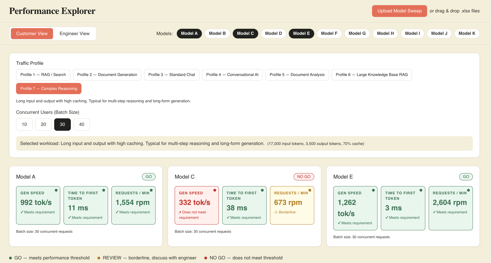
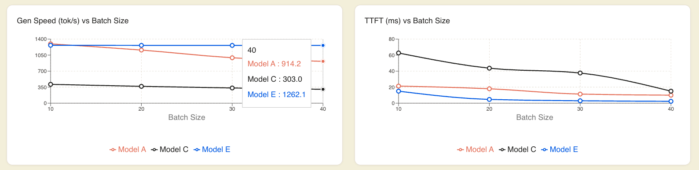
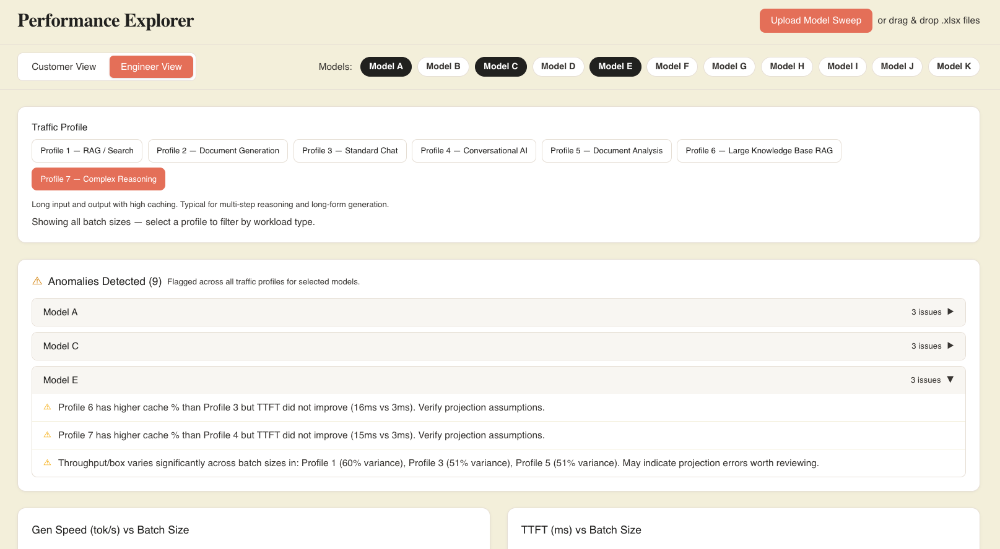

# Task 1 - Performance Explorer

**Live URL:** https://ai-model-quality-challenge-implemen.vercel.app/

<!-- TODO: hero screenshot — Customer View, 2-3 models selected, go/no-go badges visible -->

---

## Overview

Performance projections for LLM deployments as raw spreadsheets have dozens of columns, unfamiliar units, no clear signal on whether a model actually meets your needs. Two different people open that file and need two completely different things from it.

A customer or PM needs one answer: will this model keep up with my workload? An engineer needs to verify the numbers make sense before that answer reaches anyone.

This dashboard serves both without — a **Customer View** that surfaces a clear **go/no-go signal** across the metrics that matter for deployment decisions, and an **Engineer  View** with the full data, **anomaly detection**, and **visual charts** for a proper sanity check.

---

## Customer View

Of the ~19 raw columns in the projection sheet, only 3 are shown to a customer. Everything else lives in the Engineer View. The reasoning:

| Metric | Why it's in Customer View | Green (meets) | Yellow (borderline) | Red (does not meet) |
|---|---|---|---|---|
| **Gen Speed (tok/s/user)** | The number a customer associates with "how fast does text appear"  without a spec sheet | ≥ 800 | ≥ 400 | < 400 |
| **TTFT (ms)** | First-token latency is the rhe responsiveness a user feels before generation starts | ≤ 50 ms | ≤ 200 ms | > 200 ms |
| **RPM** | Total request throughput — helps answer capacity questions like "can it handle our user volume?" | ≥ 1,000 | ≥ 500 | < 500 |.   
  

*Customer View with go/no-go signals across models and traffic profiles*

---

## Engineer View

The Engineer View gives engineers two tools to validate a projection before it reaches a customer: interactive batch-scaling charts and automatic anomaly detection.

### Performance Charts

Charts show how Gen Speed and TTFT change as concurrent users scale from 10 to 40, with all selected models overlaid for direct comparison. This makes it immediately visible which models degrade gracefully under load and which drop off.


*Gen Speed and TTFT across batch sizes — all selected models overlaid*

### Anomaly Detection

Beyond displaying the data, the Engineer View automatically runs three checks across the 
full sweep and surfaces only what fires — grouped per model, collapsible. These are checks to catch the class of projection errors most likely to mislead a customer conversation.


*Anomalies flagged across all traffic profiles per model, collapsible per model*


---

## Pre-loaded data

All 11 shipped models (A–K) × 7 profiles (77 sweeps total) are pre-loaded on launch — no upload required to start comparing models.

## Upload your own sweep

Click **Upload Model Sweep** in the header and select one or more `.xlsx` files. The only
requirement is that the filename matches `Model_<X>_profile_<N>.xlsx` (or the spaced
variant `Model X profile N.xlsx`) and the file has a `Summary` sheet with the standard column layout. The model name is derived from the filename regex at runtime — no code change needed. Uploaded models join the comparison set alongside the pre-loaded models immediately.

---

## Install and Run Locally

**Prerequisites:** Node.js 18+, Python 3.10+

```bash
# Clone with submodules
git clone --recurse-submodules https://github.com/nidhiprakashhh/ai-model-quality-challenge-implementation.git
cd ai-model-quality-challenge-implementation
```

### Task 1 — Performance Dashboard

```bash
cd task1
npm install
npm run dev
```

Open http://localhost:5173 in your browser. Models A–K are pre-loaded on launch.
To test with a new model, click **Upload Model Sweep** and select one or more `.xlsx`
files matching the `Model_<X>_profile_<N>.xlsx` naming convention.

The app runs entirely in the browser — no environment variables, no API keys, no backend.

### Task 2 — Benchmark Compression

```bash
cd task2/evalscope
pip install -e ".[all]"
pip install numpy scipy Pillow datasets
```

See [task2/README.md](../task2/README.md) for full run instructions.

---


## Framework

**React + Vite + Tailwind + Recharts + SheetJS**

The core requirement was client-side xlsx parsing with interactive multi-model comparison — no backend, no rebuild on upload. React handles the stateful comparison naturally (selected models, active profile, batch size all drive the same render). SheetJS parses uploaded files entirely in the browser, so files never leave the client. Recharts composes cleanly into React's state model for the batch-scaling charts. Vite produces a flat static 
bundle that deploys directly to a CDN.

Next.js adds SSR complexity with no benefit for a fully client-side tool. Streamlit and Gradio are better fits for Python-native work and don't support the custom design system this needed. Plain HTML/JS doesn't scale to the multi-model comparison state without 
reinventing a component model.

## Assumptions

- The `Summary` sheet structure (row 1 empty, row 2 headers, data from row 3) is stable across conforming sweeps — this is the only parsing contract the tool relies on.
- The `Model_<Letter(s)>_profile_<N>` filename convention generalizes to multi-letter names (e.g. "Model AA").
- Browser-side parsing with no server persistence is appropriate for projection data. A production version handling confidential customer data would include server-side auth addition.

---

## Video walkthrough

[link] — covers what I cut and why, framework chosen vs. ruled out, assumptions,
my read on model sizes (A–K) and profile use cases (1–7), and what would change
with production data or more time (≤5 minutes).
